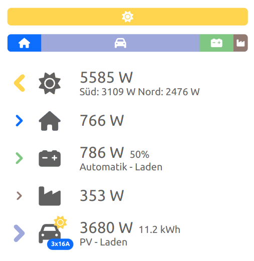
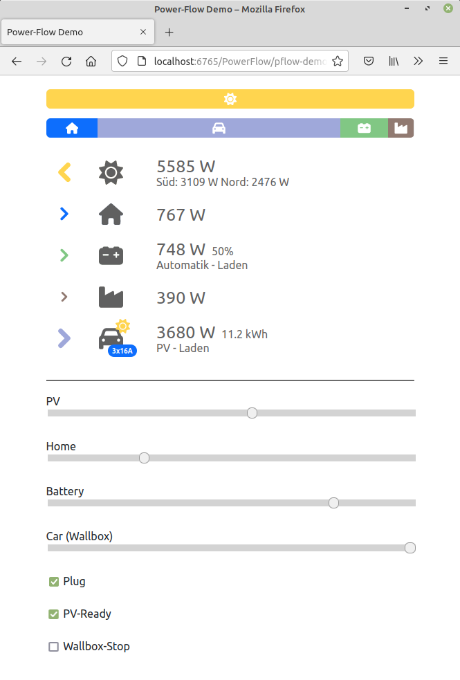

# PowerFlow

Responsive HTML/Javascript view for energy flow in building automation



## Setup
```
    table: [
        {id: 'pv', type: 'pv'},
        {id: 'car', type: 'car', sign: -1, wallbox: true}],
        ...
    bar: {
        in: [{id: 'pv', type: 'pv'}, {id: 'grid', type: 'grid'}, ...],
        out: [...]}};
```
## Data update
``` 
var d = {
    pv: {
        power: pv,
        subline: 'Süd: 3109 W  Nord: 2476 W'},
    home: {power: home},
    bat: {
        power: bat,
        info: '50%',
        subline: 'Automatik - Laden'},
    ... };          

pflow.update(d);
```

## Demo Application




